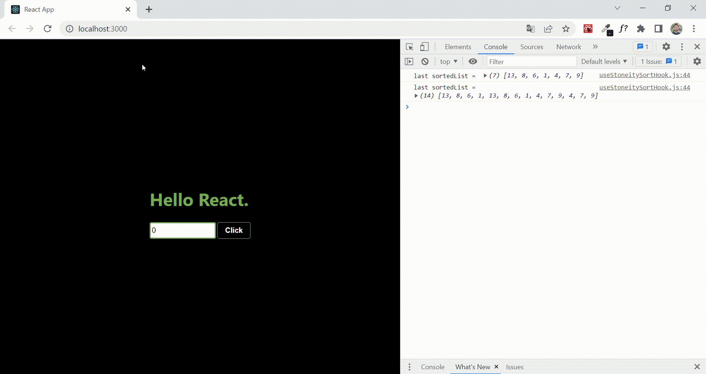

# Case for Stoneity (React)

## Preview



## Requirements
```
git clone https://github.com/volkantepeli/case-for-stoneity.git
```
```
npm install
```
```
npm start
```
## Used technologies


<br>
</br>

## Reach out to me

[linkedin]: https://www.linkedin.com/in/volkantepeli/

[][linkedin]